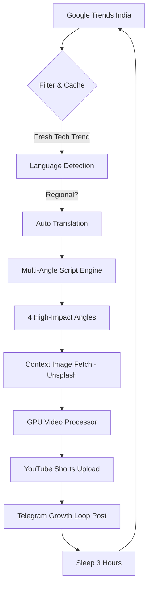

# 🎬 Trend Shorts — Autonomous Growth Engine

> **The 160+ Shorts/Day Machine.** 
> Automatically fetch trending topics → generate 4 high-conversion angles per trend → upload to YouTube → post curiosity-gap teases to Telegram.

---

## 🚀 Fully Autonomous Pipeline



---

## 🔥 Growth Strategy: Curiosity Gap

Instead of explaining everything, each video is a "Hook Machine" designed to drive traffic.

| Angle | Strategy |
|-------|----------|
| **Shock** | "STOP SCROLLING: This just changed everything." |
| **Curiosity** | "Why is everyone searching for this today?" |
| **Problem** | "The [Trend] problem is getting worse." |
| **Benefit** | "This [Trend] hack saves hours of work." |

**The Loop:** 
1. **Hook:** Scroll-stopping headline.
2. **Mystery:** What happened?
3. **CTA:** "Full story on Telegram."
4. **Link:** High-conversion referral in YouTube description and Telegram channel.

---

## 🛠 Features

### 1. Multi-Angle Scalability
Generates **4 different videos** for every single trend. 
- 5 trends per run * 4 angles = **20 videos per run.**
- Running every 3 hours = **160 videos per day.**

### 2. Global Regional Support
- **Auto-Font:** Automatically downloads *Noto Sans Devanagari* for Hindi/Marathi/Sanskrit rendering. No more square boxes.
- **Auto-Translation:** Uses `deep-translator` to convert regional trends into viral English content instantly.

### 3. Visual Retention Layout
- **Top:** Viral Hook text.
- **Center:** Dynamic context image fetched from Unsplash API.
- **Bottom:** Explanatory mystery text.
- **FX:** Zoom-in animations + fade transitions.

### 4. Resilient & Resumable
- **Duplicate Prevention:** Uses `processed_trends.json` to never post the same trend twice.
- **Global Failsafe:** Wrapped in heavy try/except blocks. If one API fails, the daemon sleeps for 60s and restarts. It **never** crashes.

---

## ⚙️ Setup

### Prerequisites
- **Python 3.10+**
- **FFmpeg** (installed and in PATH)
- **NVIDIA GPU** (optional, for `h264_nvenc` acceleration)

### Environmental Variables (`.env`)
Create a `.env` file in the root directory:
```bash
# Security: NEVER commit this file
TELEGRAM_BOT_TOKEN="your-bot-token"
TELEGRAM_CHAT_ID="your-chat-id"

# API Keys
UNSPLASH_ACCESS_KEY="your-unsplash-key"
GEMINI_API_KEY="your-optional-ai-key"
```

### Installation
```bash
python -m pip install -r requirements.txt
```

---

## ▶️ Execution

One command to rule them all:
```bash
python main.py
```

The system will:
1. Initialize fonts and check dependencies.
2. Fetch trends and filter for tech/AI topics.
3. Batch generate, render, and upload 20 videos.
4. Schedule the next run for 3 hours later.

---

## 📦 Project Modules

| Module | Responsibility |
|--------|----------------|
| `main.py` | Infinite loop, scheduler, and multi-angle batching. |
| `config.py` | Growth loop settings, keywords, and API configuration. |
| `trends.py` | 3-tier reliable trend fetching (RSS/Pytrends). |
| `script_generator.py` | Curiosity-gap templates + Auto-Translation. |
| `video_generator.py` | PIL/MoviePy rendering + Unsplash image engine. |
| `youtube_uploader.py` | Data API v3 OAuth upload with token caching. |
| `telegram_poster.py` | MarkdownV2 formatted growth loop posts. |

---

## 🛡 License
MIT - Fully autonomous. Open source.
