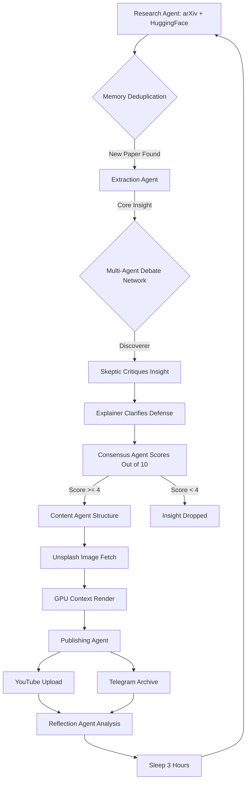

# 🧠 Agentic AI Discovery Engine

> **Formerly "Trend Shorts MVP"**
> A fully autonomous, multi-agent AI framework that crawls the internet for cutting-edge AI breakthroughs, debates them internally, and generates premium vertical videos and long-form Knowledge Archives for YouTube and Telegram.

---

## 🚀 How It Works: The Agent Network

This system operates a swarm of specialized AI agents running infinitely in a loop:



## 🛠 Features

### 1. Zero Manual Intervention
Start the script once (`python main.py`) and it runs infinitely. It handles its own exceptions, rate limits, and scheduling automatically.

### 2. Multi-Agent Debate Simulation
To ensure high-quality content, every AI discovery is debated internally before being published:
- **Discoverer Agent:** Proposes the finding.
- **Skeptic Agent:** Checks for weak metrics ("dataset only", "early stage", "theoretical").
- **Explainer Agent:** Re-evaluates for novelty ("state-of-the-art", "first time").
- **Consensus Agent:** Synthesizes a final 0-10 score. Rejects low-quality papers to save GPU cycles.

### 3. Telegram Knowledge Archive
Subscribers don't just get a video. They get a deep-dive Markdown post.
- **Agent Debate Snippet:** Viewers can read the exact critique and clarification the internal AI agents produced regarding the paper.
- **Direct Link:** Triggers click-through to the raw arXiv research paper.

### 4. GPU-Accelerated Visuals
- Native Unsplash API integration for contextually relevant background rendering.
- Automatic **Noto Sans Devanagari** font injection for handling mixed-language abstracts natively.
- `h264_nvenc` CUDA encoding.

---

## ⚙️ Setup

### Prerequisites
- **Python 3.10+**
- **FFmpeg** (installed and in PATH)

### Environmental Variables (`.env`)
Create a `.env` file in the root directory:
```bash
# Telegram Growth
TELEGRAM_BOT_TOKEN="your-telegram-bot-token"
TELEGRAM_CHAT_ID="your-telegram-chat-id"

# APIs
UNSPLASH_ACCESS_KEY="your-unsplash-access-key"
```

### Installation
```bash
python -m pip install -r requirements.txt
```

---

## ▶️ Execution

One command to wake up the swarm:
```bash
python main.py
```

The system will:
1. Scan arXiv & HuggingFace for brand-new papers.
2. Debate the papers for validity.
3. Automatically render 1080x1920 MP4s.
4. Auto-upload to YouTube via OAuth.
5. Push a Knowledge Archive to Telegram.
6. Sleep and repeat.

---

## 📂 Architecture

| Agent / Module | Responsibility |
|--------|----------------|
| `main.py` | Global orchestration, memory deduplication, failsafes, and the Reflection Agent. |
| `script_generator.py` | Multi-Agent Debate Logic, Consensus scoring, and Content formatting. |
| `trends.py` | The HTTP Research Agent polling academic databases. |
| `video_generator.py` | PIL compositing, MoviePy VFX, and Unsplash background sourcing. |
| `youtube_uploader.py` | Google Data API v3 integration with auto-token refresh. |
| `telegram_poster.py` | MarkdownV2 formatting for the Knowledge Archives. |
